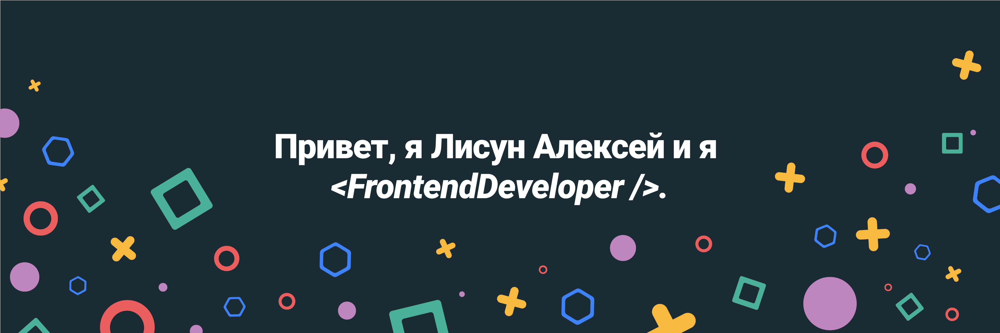

## Последние посты 👀

- [Превращаем Github профиль в портфолио](https://teletype.in/@life_verstka/github-profile-to-portfolio)

- [6 полезных паттернов во Vue](https://teletype.in/@life_verstka/6_vue_2_patterns)

- [Хотите сделать анимацию на сайте? Расскажу, как сделать это правильно](https://teletype.in/@life_verstka/good_css_animations)

## Профессиональные навыки 💼

Все навыки 

 

 

 

